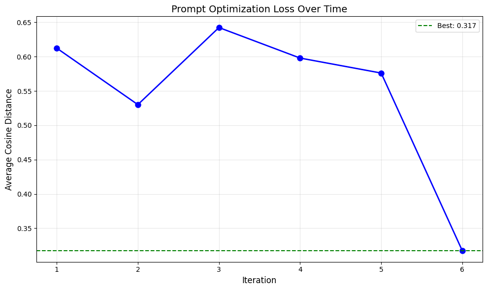

# Self‑Improving Prompt Optimisation

This repository contains an implementation of a **self‑improving prompt
optimisation loop** for large language models (LLMs).  Given a set of social
media comments and example responses in a CSV file, the code builds a
persona‑driven prompt and repeatedly **tests, critiques, patches and
re‑tests** that prompt to reduce the gap between generated replies and the
ground truth.  The approach is inspired by contemporary prompt engineering
research, which frames prompt design as an iterative process guided by
experimentation and heuristics rather than fixed rules.  As Lilian Weng notes,
prompt engineering is about **steering a model’s behaviour without updating
its weights** and often requires heavy experimentation and heuristics.

## Why self‑improve your prompts?

Good prompts significantly improve the quality and relevance of AI outputs.
Prompt engineering practitioners recommend that you explicitly set the model’s
role, result, intent, context and constraints.  Beyond initial
structure, reflective practices such as **reviewing, questioning and tweaking
prompts** lead to better results.  Asking the model to explain its
reasoning and critique its own answers encourages an iterative refinement
process.  This project automates that process: after each
evaluation, the model itself identifies where its responses deviate from the
desired output, proposes concrete changes to the prompt, and applies those
changes through a unified diff.  Over successive iterations the prompt becomes
more aligned with the task, as measured by a reduction in cosine distance.

## Background: from prototype to production

This repository represents **an early prototype** of the prompt optimisation
system that eventually became the backbone of Superpower Social's production
platform.  The original goal was to improve a static persona profile for
automated social‑media replies.  Over time we observed that the usefulness of
the system **decreased**: the model's voice and tone drifted away from the
desired persona and the accuracy of responses slipped.  The insight that
unlocked a step change in quality was to treat the initial persona prompt as an
**initializer for downstream tasks**—comment generation, moderation,
recommendations—and to **iteratively update** that prompt using unified diff
patches, much like how code changes are tracked in git.  By combining this
approach with a **mixture‑of‑experts** that nudges the prompt towards outputs
closer to ground‑truth labels, we achieved a persona that stays aligned and
responsive as conditions change.  While the production version now deployed for
enterprise brands is far more sophisticated, the loop and structure you see
here formed the first working prototype that proved the idea viable.

## Repository structure

```
prompt_optimization_repo/
├── prompt_optimization/       # Python package containing core logic
│   ├── __init__.py            # Package exports
│   ├── config.py              # Dataclass defining hyper‑parameters
│   ├── utils.py               # Helper functions (load data, build prompts, diff)
│   └── main.py               # Command‑line interface for optimisation
├── notebooks/
│   └── self_imp_prompt_latest.ipynb  # Original Jupyter notebook
├── loss_prompt_opt.png        # Example optimisation loss chart
├── requirements.txt           # Python dependencies
└── README.md                  # Project overview and usage instructions
```

* The `prompt_optimization` package refactors the original notebook into
  reusable modules.  Functions are documented and type‑annotated for clarity.
* `main.py` provides a CLI that reproduces the notebook’s optimisation loop.
* The `notebooks` directory preserves the original exploratory notebook for
  reference.  You can run it end‑to‑end in Jupyter if you prefer an
  interactive environment.

## Installation

1. **Clone the repository** and change into its directory:

   ```bash
   git clone <repository_url>
   cd prompt_optimization_repo
   ```

2. **Create a virtual environment** (recommended):

   ```bash
   python3 -m venv .venv
   source .venv/bin/activate
   ```

3. **Install dependencies** from the provided `requirements.txt`:

   ```bash
   pip install -r requirements.txt
   ```

4. **Set your OpenAI API key** as an environment variable.  Without this
   key the optimisation script will raise an error when it attempts to call
   the API:

   ```bash
   export OPENAI_API_KEY=sk-...
   ```

   **Never commit your secret API key to source control.  Use environment variables or a secrets manager instead.**

## Usage

### Preparing your data

The optimisation loop requires two files:

1. A **CSV file** containing the training data.  It must have at least
   two columns:

   * `comment` – the raw social media comment.
   * `response` – the desired reply to that comment.

   Rows with missing values will be dropped automatically.  You can add
   additional columns (e.g. categories) if they are useful for your own
   analysis, but the script will ignore them.

2. A **persona profile** in plain text (`profile.txt`).  This file should
   describe the tone, style and constraints you want the AI to adopt when
   replying.  For example, you might instruct the model to be empathetic,
   concise and to avoid sensitive topics.  Clearly stating the model’s
   role, desired result, intent, context and constraints helps the model
   deliver targeted responses.

Place both files in the working directory or pass their paths via
command‑line arguments.

### Running the CLI

To optimise a prompt using the command line interface, run:

```bash
python -m prompt_optimization.main \
  --csv-path path/to/training_data.csv \
  --profile-path path/to/profile.txt \
  --n-exemplars 10 --n-iterations 20
```

You can override any hyper‑parameter defined in `config.py` via flags:

* `--n-exemplars`: number of exemplar pairs included in the initial prompt.
* `--train-size` / `--val-size`: number of comments sampled per iteration.
* `--n-iterations`: maximum optimisation rounds.
* `--dist-threshold`: cosine distance above which outputs are considered
  misses and included in the critique.
* `--min-improvement`: minimum drop in validation distance required to
  accept a new prompt.
* `--model-name`: OpenAI model identifier to use (e.g. `gpt-4-turbo`).

During execution the script will print the average cosine distance on the
training and validation sets at each iteration.  When an improved prompt
reduces the validation distance, it is accepted; otherwise the previous
prompt is retained.  Early stopping occurs if a target distance is reached
(`good_threshold`) or if no improvement is seen for several rounds
(`patience`).  At the end the best prompt is printed and a plot of the
validation distances over time is shown (if matplotlib is available).

### Running the notebook

If you prefer an interactive workflow, open `notebooks/self_imp_prompt_latest.ipynb`
in Jupyter.  The notebook contains the original exploratory implementation
complete with live charts and cell outputs.  This repository’s Python
package mirrors the notebook’s functionality but with improved structure.

## Example results

The chart below shows the average cosine distance (lower is better) across
20 optimisation iterations on a sample dataset.  The green dashed line marks
the best average distance achieved during the run.  You can expect your own
results to vary depending on your data, persona and model choice.



In this example the initial prompt achieved an average distance around 0.59.
After multiple rounds of critique and patching the prompt, the best average
distance dropped to 0.505, indicating closer alignment between generated
replies and ground truth.  As with most prompt engineering tasks the
specific numbers will depend heavily on your training data and model; use the
plot as a diagnostic tool rather than an absolute benchmark.

## Prompt engineering best practices

- **Define the five critical elements** – Role, Result, Intent, Context and
  Constraint – in your persona description.  This structure
  clarifies what you expect from the model and narrows its output space.
- **Iterate with reflection and self‑critique**.  Don’t settle for the first
  answer.  Review, question and tweak your prompt based on where the model
  falls short.  Encourage the model to explain its
  reasoning and then critique its own output; this iterative process leads
  to more thoughtful and accurate results.
- **Measure performance**.  Use objective metrics such as cosine distance or
  Levenshtein ratio to quantify how closely the model’s replies match the
  desired output.  Optimisation without measurement is guesswork.
- **Stay within safe content boundaries**.  Avoid asking the model to
  generate or process harmful content.  In your persona specify topics to
  avoid and instruct the model to be respectful and unbiased.  Never train
  or evaluate prompts on sensitive personal data.
- **Be mindful of costs**.  Each iteration requires API calls that consume
  tokens.  Adjust the batch sizes, number of iterations and model
  selection to balance cost and accuracy.

## Contributing

Contributions are welcome!  If you encounter a bug or have ideas for
improvements, please open an issue or submit a pull request.  Areas that
could benefit from community input include:

* Integrating alternative similarity metrics or embedding models.
* Adding support for other LLM providers or open‑source models.
* Enhancing the CLI to log intermediate prompts and critiques.
* Extending the evaluation to cover style, tone or toxicity metrics.

When submitting code please ensure it passes linters (`flake8`), includes
unit tests where applicable, and contains appropriate docstrings.

## License

This project is licensed under the MIT License.  See `LICENSE` for
details.  Please review the terms before using the code in a commercial
context.
